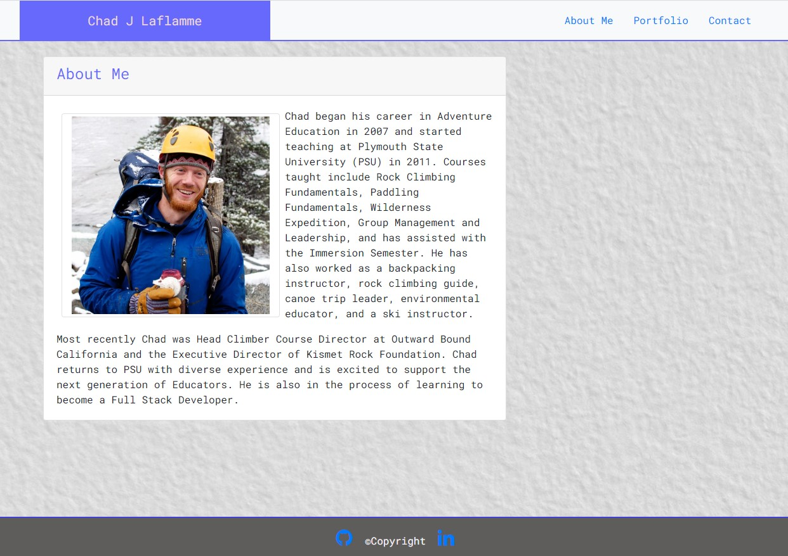
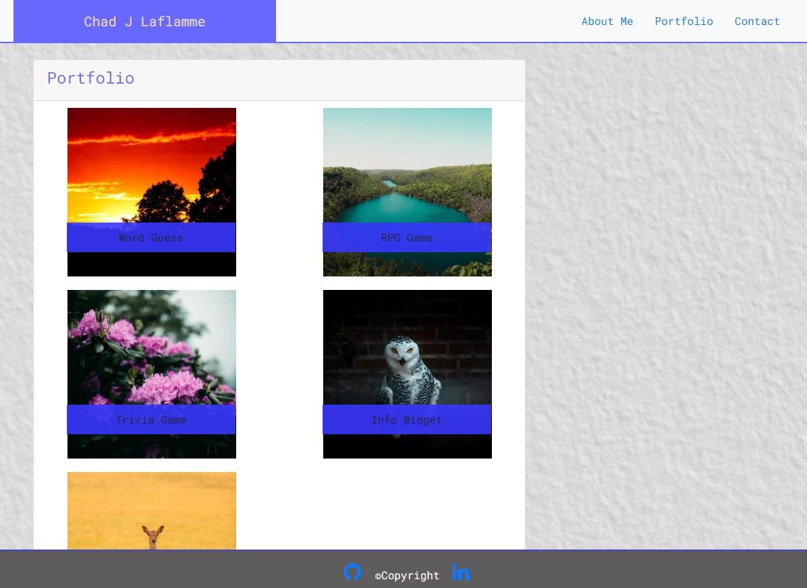
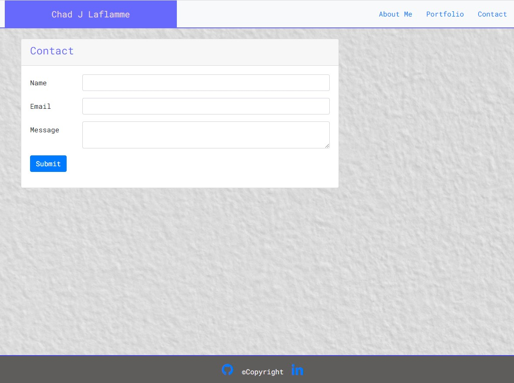

# 2_Responsive_Portfolio
# Homework assignment #2. 

## About the Project

For this homework assignment, we were tasked with recreating a personalized portoflio with Bootstrap that is responsive to a wide range of screen sizes.  The website must include an About Me (index), Portfolio, and Contact page.  

[Link to Website]( https://cjlaflamme1.github.io/2_Responsive_Portfolio/)

---

## Biggest Challenges

In an effort to remember for future development, these are some of greater challenges ecountered during this project: 

1. Bootstrap Navbar: The navbar options in bootstrap were generally very difficult to work with.  I ended up using a combination of some of the suggested strategies. 

2. Bootstrap Footer: In order to secure the footer to the bottom of the page I used a `fixed-bottom` class.  This introduced a new issue where the footer would cover content on the page even after scrolling to the bottom.  I learned this was because the new class created a `position: absolute;` value.  After adding substantial margin to the bottom of the main HTML element the issue was resolved.  

3. The final notable challenge was modifying the margin and padding to the color banner along the top of the web page when transitioning to various screen sizes.  First, finding where the padding was coming from was a challenge, but I learned a lot about using the inspector during that process. Second, I learned that you could insert margin classes based on screen size through Bootstrap without having to introduce media queries.  

---

## Screen Shots

### About Me

### Portfolio 

### Contact
